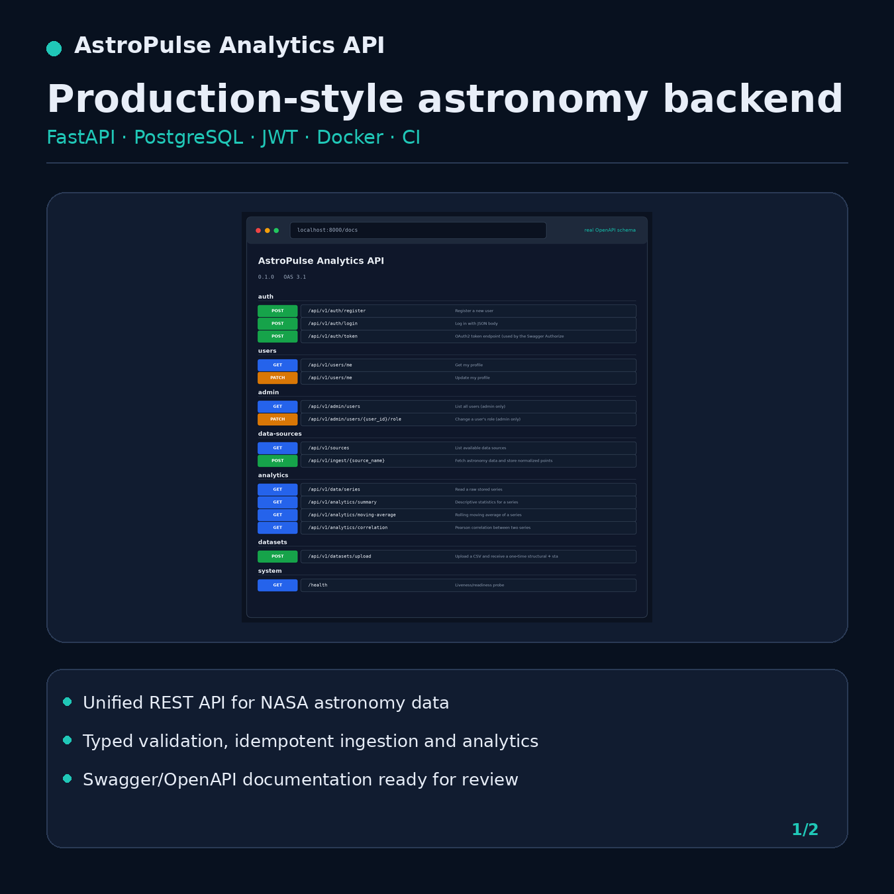
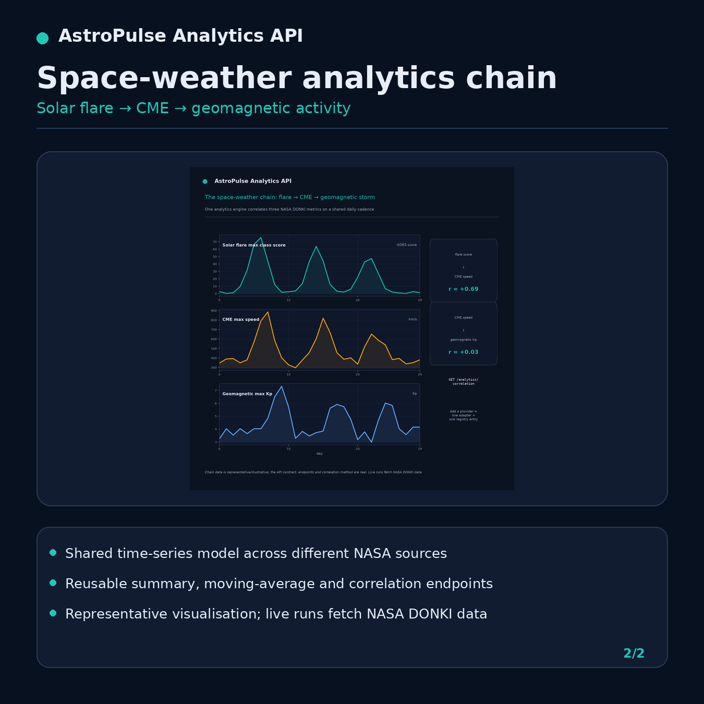
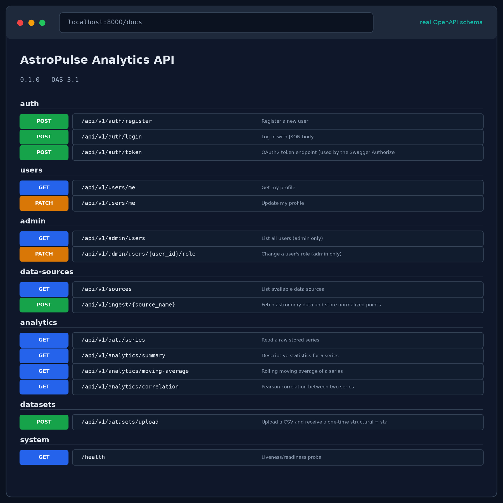
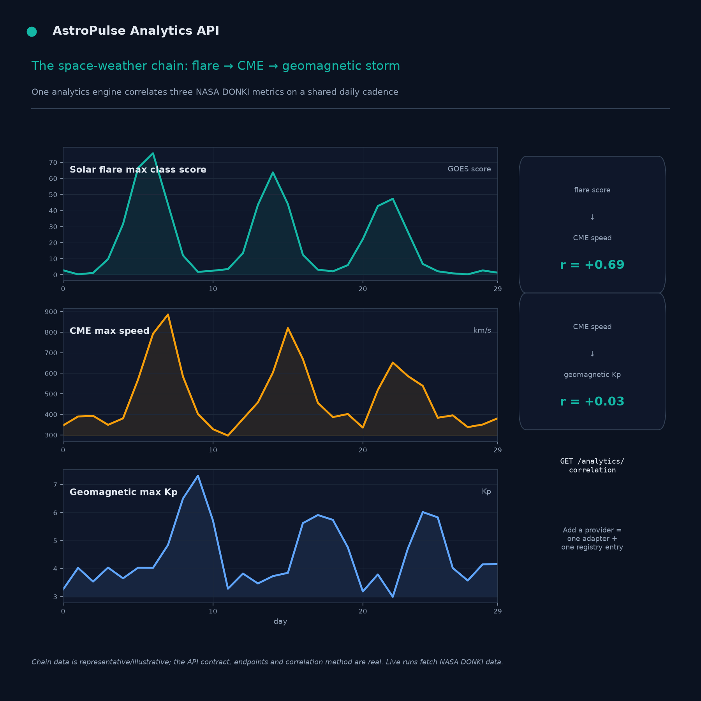
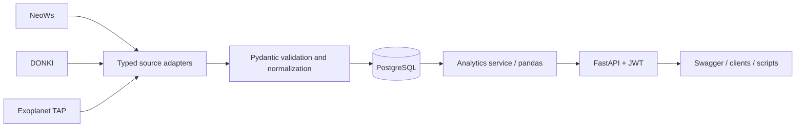

# AstroPulse Analytics API

A production-style **Python astronomy backend** built with FastAPI.

AstroPulse collects data from three NASA astronomy services, normalizes
heterogeneous provider records into a shared time-series model, persists the
result in PostgreSQL, and exposes reusable analytics through an authenticated
REST API.

[](https://www.python.org/)
[](https://fastapi.tiangolo.com/)
[](https://www.postgresql.org/)
[](https://api.nasa.gov/)
[](https://github.com/Ali-Razeghi/astropulse-analytics-api/actions/workflows/ci.yml)
[](LICENSE)

> **Portfolio scope:** this repository demonstrates backend engineering,
> data integration, validation, analytics, testing, containerization, and CI.
> It is not an operational asteroid-warning or space-weather forecasting system.

## Portfolio preview

<p align="center">
  
  
</p>

The first image presents the documented API surface. The second presents the
space-weather analytics workflow. The visualization is representative; live
application runs fetch provider data through the implemented adapters.

## Technical evidence

### OpenAPI documentation generated by the application

<p align="center">
  
</p>

### Shared analytics across the space-weather chain

<p align="center">
  
</p>

The Swagger endpoint list is rendered from the application's actual OpenAPI
schema. The space-weather figure demonstrates how one analytics engine can
operate on normalized daily metrics from the DONKI adapter.

## Data domains

| Domain | Provider | Normalized metrics |
|---|---|---|
| Near-Earth objects | NASA NeoWs / JPL | closest daily miss distance, mean velocity, object count, hazardous count |
| Space weather | NASA CCMC DONKI | flare class score/count, CME maximum speed, geomagnetic maximum Kp |
| Exoplanets | NASA Exoplanet Archive TAP | discoveries per year, median radius, median orbital period |

These sources deliberately differ in structure and cadence. The engineering
objective is to place them behind one consistent ingestion and analytics
interface.

## Architecture



Request flow:

```text
API route
    -> service
    -> source adapter or repository
    -> PostgreSQL
    -> analytics response
```

The project follows a layered design:

- **API layer**: HTTP routes and request dependencies
- **Service layer**: business logic and transaction boundaries
- **Repository layer**: database access
- **Source adapters**: provider-specific collection and normalization
- **Schema layer**: typed request and response contracts

## Engineering features

- Async FastAPI endpoints
- Async HTTPX provider clients
- PostgreSQL with SQLAlchemy 2.0 async ORM
- Alembic database migrations
- JWT authentication
- Role-based authorization foundation
- Source-specific Pydantic parameter validation
- Idempotent ingestion
- Unique `(source, series_key, timestamp)` storage constraint
- Standardized API error envelope
- Summary statistics
- Rolling moving averages
- Timestamp-aligned Pearson correlation
- CSV data-quality profiling as a separate workflow
- Offline deterministic tests with Pytest and respx
- Ruff linting and formatting
- Strict MyPy type checking
- Docker and Docker Compose
- GitHub Actions continuous integration

## API groups

| Group | Purpose |
|---|---|
| `auth` | registration, login, OAuth2-compatible token endpoint |
| `users` | current-user profile access and update |
| `admin` | admin-only user listing and role changes |
| `data-sources` | provider discovery and data ingestion |
| `analytics` | raw series, summaries, moving averages, correlation |
| `datasets` | one-time CSV structural and statistical profiling |
| `system` | health/readiness endpoint |

Swagger documentation is available locally at:

```text
http://localhost:8000/docs
```

ReDoc is available at:

```text
http://localhost:8000/redoc
```

## Quick start with Docker

### 1. Create the environment file

Copy the example file:

```bash
cp .env.example .env
```

On Windows, you can copy `.env.example` manually and rename the copy to `.env`.

### 2. Set a strong secret

Open `.env` and replace the example value:

```env
SECRET_KEY=replace-with-a-long-random-secret
```

For initial NeoWs exploration, NASA's `DEMO_KEY` can be used:

```env
NASA_API_KEY=DEMO_KEY
```

A personal NASA API key is preferable for higher request limits.

### 3. Start the stack

```bash
docker compose up --build
```

Then open:

```text
http://localhost:8000/docs
```

## Local development

Create and activate a virtual environment:

```bash
python -m venv .venv
```

Windows:

```bash
.venv\Scripts\activate
```

macOS or Linux:

```bash
source .venv/bin/activate
```

Install the project and development dependencies:

```bash
pip install ".[dev]"
```

Apply migrations:

```bash
alembic upgrade head
```

Run the API:

```bash
uvicorn app.main:app --reload
```

## Example workflow

### 1. Register

```http
POST /api/v1/auth/register
```

```json
{
  "email": "user@example.com",
  "password": "a-strong-password"
}
```

### 2. Log in

```http
POST /api/v1/auth/login
```

Use the returned bearer token through Swagger's **Authorize** button or in the
`Authorization` header.

### 3. Ingest near-Earth-object data

```http
POST /api/v1/ingest/neo
```

```json
{
  "days": 7,
  "metric": "closest_miss_distance_km"
}
```

### 4. Ingest space-weather data

```http
POST /api/v1/ingest/space-weather
```

```json
{
  "days": 30,
  "metric": "flare_max_class_score"
}
```

### 5. Ingest exoplanet data

```http
POST /api/v1/ingest/exoplanets
```

```json
{
  "start_year": 2010,
  "end_year": 2026,
  "metric": "discoveries"
}
```

### 6. Request analytics

```http
GET /api/v1/analytics/summary
    ?source=neo
    &series_key=neo/closest_miss_distance_km
```

```http
GET /api/v1/analytics/moving-average
    ?source=space-weather
    &series_key=space-weather/flare_max_class_score
    &window=3
```

```http
GET /api/v1/analytics/correlation
    ?source_a=space-weather
    &series_key_a=space-weather/flare_max_class_score
    &source_b=space-weather
    &series_key_b=space-weather/cme_max_speed_kms
```

## Scientific interpretation

The project distinguishes software output from scientific interpretation.

- **Correlation is not event attribution.** A positive correlation between
  flare score and CME speed does not prove that every flare caused the paired
  CME, or that every CME caused the paired geomagnetic response.
- **Exoplanet discovery trends contain selection effects.** Median radius by
  discovery year reflects survey sensitivity, detection methods, and catalog
  completeness; it is not evidence that planets physically evolved across
  those calendar years.
- **`flare_max_class_score` is an ordinal analytical encoding.** GOES flare
  classes are mapped to sortable numeric values for aggregation. The score is
  not a replacement for calibrated physical flux.
- **Quiet intervals can be valid.** An empty provider window may represent a
  genuinely quiet period and is returned explicitly as `NO_DATA_RETURNED`.
- **DONKI is not an operational forecast system.** Its records are appropriate
  for research, education, and software prototyping.

## CSV profiling scope

CSV upload is implemented as a separate one-time profiling workflow. The API
returns:

- row and column counts
- missing-value counts
- duplicate-row counts
- inferred column types
- selected numerical statistics

CSV files and profiles are **not currently persisted**. Persistent dataset
management is part of the roadmap.

## Quality gates

Run these checks before publishing changes:

```bash
ruff check app tests
ruff format --check app tests
mypy app
pytest -q
docker build -t astropulse-analytics-api .
```

The workflow at `.github/workflows/ci.yml` runs the quality gates and Docker
build for pushes and pull requests targeting `main`.

## Repository layout

```text
app/
├── api/                    HTTP routes and dependencies
├── core/                   configuration, security and exceptions
├── db/                     async database engine and sessions
├── models/                 SQLAlchemy models
├── repositories/           persistence operations
├── schemas/                Pydantic contracts
├── services/               business logic
└── sources/                NASA provider adapters

alembic/                    database migrations
tests/                      deterministic offline tests
docs/linkedin/              README and LinkedIn images
outputs/                    documented provider snapshots
scripts/                    container entrypoint and image generation
.github/workflows/          continuous-integration workflow
```

Important source adapters:

```text
app/sources/neo.py
app/sources/space_weather.py
app/sources/exoplanets.py
```

## Data snapshots and provenance

The `outputs/` directory contains documented snapshots and a provenance file:

```text
outputs/neo_snapshot.json
outputs/donki_snapshot.json
outputs/exoplanet_snapshot.json
outputs/PROVENANCE.md
```

Review `outputs/PROVENANCE.md` before reusing screenshots or sample values in
external publications.

## Current limitations

- Provider availability and rate limits remain external dependencies.
- Exoplanet aggregation currently runs in memory after TAP retrieval.
- No background scheduler is included.
- No Redis cache or rate limiter is included.
- Access-token refresh is not implemented.
- RBAC is a foundation rather than a complete authorization policy.
- CSV profiles are not persisted.
- Comprehensive private dataset ownership is not yet implemented.
- The repository is a portfolio MVP, not an operational monitoring platform.

## Roadmap

- Scheduled ingestion worker
- Redis caching and rate limiting
- Refresh-token rotation
- Expanded RBAC policies
- Persistent user-owned datasets
- SQL-side aggregation for larger series
- A separate Streamlit or React dashboard consuming the API
- Deployment with HTTPS, monitoring, and structured production logging

## Attribution

Data providers:

- NASA Open APIs / JPL NeoWs
- NASA CCMC DONKI
- NASA Exoplanet Archive, operated by Caltech under NASA's Exoplanet
  Exploration Program

Review each provider's data-use and publication policies before scientific
publication.

## Author

**Ali Razeghi**

- GitHub: [github.com/Ali-Razeghi](https://github.com/Ali-Razeghi)
- Portfolio: [ali-razeghi.github.io](https://ali-razeghi.github.io/)

## License

This project is released under the [MIT License](LICENSE).
